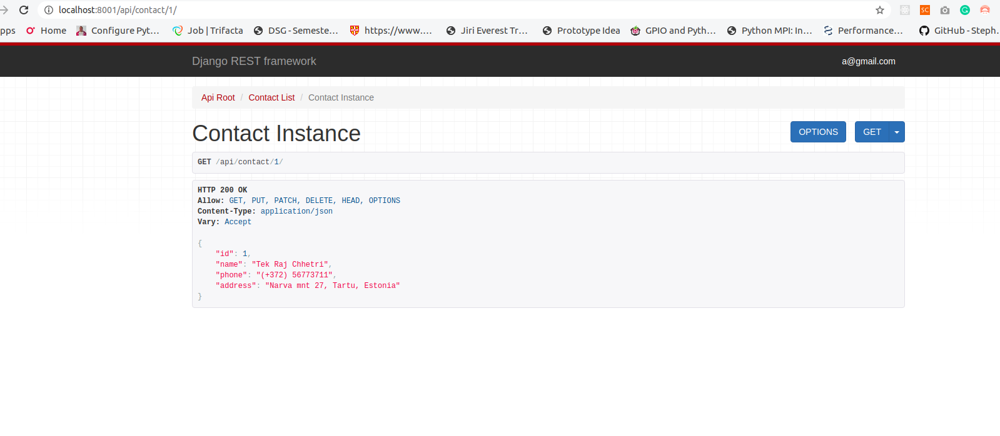

# Contact Rest API

REST API for contact management with token based authentication.


### Prerequisites

Python 3.X

Django

Django REST
```
pip install package
```


## Running
If 8000 port is used then provide alternative port number.
```
cd root-directory
python manage.py runserver [portnumber]

```



## Built With

* [Django](https://www.djangoproject.com/) - The web framework used
* [Django REST Framework](https://www.django-rest-framework.org/) - The REST framework


## License

This project is licensed under the MIT License - see the [LICENSE](LICENSE) file for details

